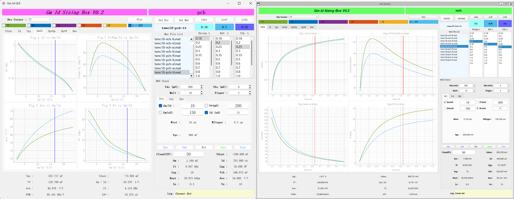

# gmIdNeoKit_tsmc18

TSMC 180nm PDK 模拟电路设计自动化工具集（gm/ID 查找表生成 + GUI 器件尺寸规划）。

本项目基于 [gmIdNeoKit](https://github.com/fengqzHD/gmIdNeoKit)，对 TSMC 180nm 工艺库的 1.8V 和 5V MOS 器件（nch / pch / nch_5v / pch_5v）进行 Spectre （Cadence IC617）扫描仿真、数据提取，生成 gm/ID 查找表，并通过 PyQt5 GUI 完成器件尺寸的交互式规划。



---

## 项目结构

```
.
├── DATAGEN/                # 原始 MATLAB 参考脚本（Paul G.A. Jespers & Boris Murmann）
│   ├── cornerSw_*          # 工艺角扫描配置与运行
│   └── techSw_*            # 工艺切换配置、调试与运行
├── GUI/                    # PyQt5 GUI 应用（基于查找表的 MOS 尺寸规划与优化）
│   ├── gmIdSizingGuiVp1.py # GUI 主程序
│   ├── gmIdSizingGuiVp1.ui # Qt Designer UI 源文件
│   ├── LupMos.py           # MOS 器件数据解析与插值
│   ├── const.py            # 常量定义
│   ├── runGmIdSizing.py    # GUI 启动入口
│   ├── png2ico.py          # png → ico 图标转换脚本
│   ├── gmId.ico / gmId.png # 应用图标
│   ├── gmIdSizing.desktop  # Linux 桌面入口
│   ├── setup.iss           # Inno Setup 打包脚本
│   ├── BUILD.md            # 构建命令说明
│   └── README.org          # GUI 原始说明文档
├── config_tsmc18.py        # 1.8V 器件扫描参数配置
├── config_tsmc18_5v.py     # 5V 器件扫描参数配置
├── run_sim.py              # 1.8V 器件 Spectre 并行仿真
├── run_sim_5v.py           # 5V 器件 Spectre 并行仿真
├── extract_new.py          # 统一数据提取脚本（1.8V + 5V），生成 .mat 查找表
├── psf_reader.py           # PSF 格式仿真结果读取器
├── workflow.py             # **顶层一键脚本**：串联扫描 → 提取 → 清理全流程
└── gmId_tsmc18_Demo.png    # 工具截图
```

## 运行环境

| 组件                 | 环境要求                                                                  |
| -------------------- | ------------------------------------------------------------------------- |
| Spectre 扫描仿真     | VMware 虚拟机 + CentOS 6.5 + Cadence Virtuoso IC 6.1.7                    |
| 数据提取 & .mat 生成 | Python 3.6.8（CentOS 6.5 上从源码编译安装）或 Windows 本地 Python         |
| GUI 应用             | 预构建安装包开箱即用（推荐）；或 Python 3.x + PyQt5, pyqtgraph, h5py, scipy, numpy |

> **注意**：CentOS 6.5 过于老旧，Python 3.6.8 需从源码编译。更高版本的 Python 理论上也可工作，但未完整测试。

## 快速开始

### 1. 顶层一键运行（推荐）

在虚拟机中执行 `workflow.py`，自动完成所有器件的扫描仿真 → 数据提取 → 原始文件清理：

```bash
python workflow.py --outdir /path/to/output --fine --workers 5
```

可选参数：

| 参数               | 说明                                     |
| ------------------ | ---------------------------------------- |
| `--outdir <dir>` | 输出目录（**必需**）               |
| `--fine`         | 启用精细扫描模式（步长更小，数据量更大） |
| `--workers <n>`  | 并行仿真/提取的进程数（默认 5）          |
| `--skip-18v`     | 跳过 1.8V 器件                           |
| `--skip-5v`      | 跳过 5V 器件                             |

### 2. 分步运行

#### Step 1 — 扫描仿真

```bash
# 1.8V 器件
python run_sim.py --corner tt --outdir /path/to/output
# 5V 器件
python run_sim_5v.py --corner tt --outdir /path/to/output
```

#### Step 2 — 数据提取

```bash
# 提取 .mat 查找表（可在 Windows 本机执行，耗时约为虚拟机的 1/3 ）
python extract_new.py --voltage 18 --fine --outdir /path/to/output --workers 5
python extract_new.py --voltage 5v --fine --outdir /path/to/output --workers 5
```

#### Step 3 — 启动 GUI

```bash
cd GUI
pip install PyQt5 pyqtgraph h5py scipy numpy
python runGmIdSizing.py
```

## 磁盘空间需求

| 阶段                                           | 数据量              |
| ---------------------------------------------- | ------------------- |
| 1.8V 器件 (nch/pch) 精细仿真最终 .mat 文件     | ~4+ GB              |
| 5V 器件 (nch_5v/pch_5v) 精细仿真最终 .mat 文件 | ~20 GB              |
| 1.8V 器件原始仿真输出                          | ~90+ GB             |
| 5V 器件原始仿真输出（单阶段）                  | ~140 GB / 阶段      |
| **建议空闲磁盘空间**                     | **≥ 200 GB** |

> `workflow.py` 已将 5V 器件扫描拆分为 3 个阶段，每阶段仿真完成后立即提取并删除原始文件，以节省磁盘占用。如果预算仍然紧张，可进一步拆分为更细粒度的阶段。

## 性能说明

| 环境                          | 说明                                         |
| ----------------------------- | -------------------------------------------- |
| 虚拟机完整流程                | 总计约 7~8 小时（扫描 + 提取均在虚拟机完成） |
| 虚拟机扫描 + Windows 本地提取 | 可节省约 1~2 小时（提取耗时缩至 1/3）        |

> **IO 瓶颈**：使用 VMware 共享文件夹作为输出目录会显著降低 IO 速度，导致提取解析耗时大幅延长。如果追求速度，建议将输出目录设在虚拟机内部磁盘（注意磁盘分区容量），仅在最终 .mat 文件完成后复制到 Windows。

## GUI 使用说明

### Windows 用户（推荐预构建安装包）

直接下载 `gmIdSizing_Setup.exe` 安装包运行即可，无需安装 Python 解释器及依赖库，开箱即用。

> 也可使用 Python 脚本启动：`pip install PyQt5 pyqtgraph h5py scipy numpy` 后执行 `python runGmIdSizing.py`，建议有二次开发需求的用户使用。

### Linux 用户

优先使用预构建的 `.deb` 包。若你的发行版或架构不支持 `.deb`（如 Fedora、Arch、ARM 等），可直接通过 Python 脚本启动：

```bash
pip install PyQt5 pyqtgraph h5py scipy numpy
python runGmIdSizing.py
```

### 操作概要

详见 `GUI/README.org`，概要如下：

1. **加载数据**：点击 `Sel` 选择 .mat 文件所在目录 → 选择文件 → `Set` 设定
2. **设置栅长**：选择 `Ldes`（期望栅长）、`Lref`（参考栅长）、`Lchk`（检查栅长）
3. **绘图**：点击 `Plot` 查看 Vstar / Id / Vgs / GmId 关系曲线
4. **器件尺寸规划**：支持 Syn（偏置计算）、Cal（参数核算）、Opt（跨 L 优化）三种模式

## 致谢

- [gmIdNeoKit](https://github.com/fengqzHD/gmIdNeoKit) — fengqzHD 前辈创建的 GUI 应用（进行了些许 bug 修复与界面调整）
- Paul G.A. Jespers & Boris Murmann — gm/ID 方法学及 [gm/ID Starter Kit](https://web.stanford.edu/~murmann/gmid)

## 交流与联系

欢迎模拟电路设计相关探讨、问题反馈或功能建议。

| 联系方式 | 信息 |
| -------- | ---- |
| 邮箱     | zz6zz666@qq.com |
| QQ / 微信 | 1807651273 |

— SEU ZZ
